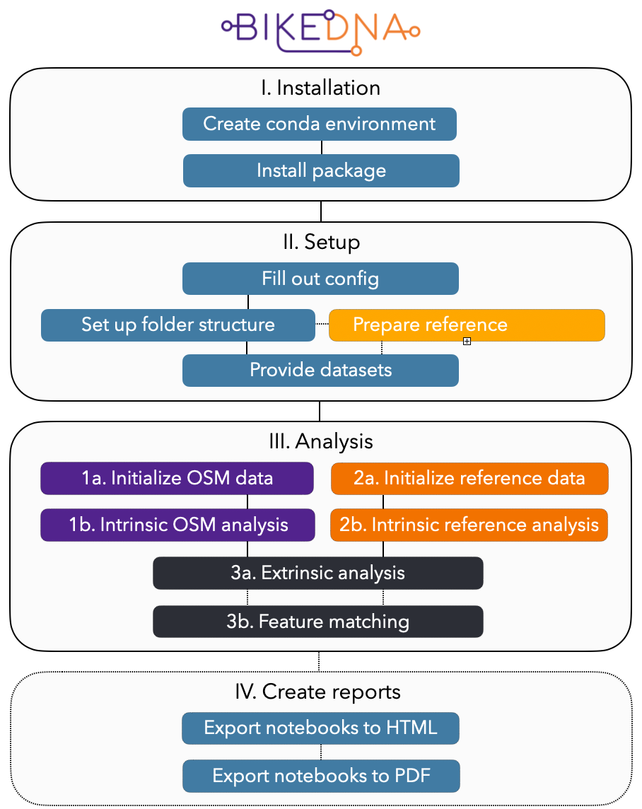

<p align="center"></p>

# BikeDNA: Bicycle Infrastructure Data & Network Assessment

This is the repository of BikeDNA, a tool for assessing the quality of [OpenStreetMap (OSM)](https://www.openstreetmap.org/) and other bicycle infrastructure data sets in a reproducible way. It provides planners, researchers, data maintainers, cycling advocates, and others who work with bicycle networks a detailed, informed overview of data quality in a given area.

**Paper:** <https://journals.sagepub.com/doi/10.1177/23998083231184471>

Running BikeDNA on large data sets? Consider using [**BikeDNA BIG**](https://github.com/anerv/BikeDNA_BIG).

<details><summary>Background</summary>

A fair amount of research projects on OpenStreetMap and other forms of volunteered geographic information (VGI) have already been conducted, but few focus explicitly on data on bicycle infrastructure. Doing so is however important because paths and tracks for cyclists and pedestrians often are mapped last and are more likely to have errors ([Barron et al., 2014](https://onlinelibrary.wiley.com/doi/10.1111/tgis.12073), [Neis et al. 2012](https://www.mdpi.com/1999-5903/4/1/1)). Moreover, the spatial distribution of dips in data quality are often not random in crowdsourced data but correlate with population density and other characteristics of the mapped area ([Forghani and Delavar, 2014](https://www.mdpi.com/2220-9964/3/2/750)). This necessitates a critical stance towards the data we use for our research and planning, despite the overall high quality of OSM.

*Data quality* covers a wide range of aspects. The conceptualization of data quality used here refers to *fitness-for-purpose* ([Barron et al., 2014](https://onlinelibrary.wiley.com/doi/10.1111/tgis.12073)) - this means that data quality is interpreted as whether or not the data fulfils the user needs, rather than any universal definition of quality. BikeDNA has been developed to particularly support network-based research and planning, and therefore provides insights into the topological structure of the bicycle network apart from data coverage, while positional accuracy is not directly evaluted.

The purpose is not to give any final assessment of the data quality, but to highlight aspects that might be relevant for deciding whether the data for a given area is fit for use. While BikeDNA can make use of a reference data set to compare with OSM data, if reference data is available, the tool makes no assumption of which, if any, data set represents the true conditions. OSM data on bicycle infrastructure is often at a comparable or higher quality than governmental data sets, but the interpretation of differences between the two requires adequate knowledge of the local conditions.

</details>

## Workflow

BikeDNA consists of Jupyter notebooks that analyze bicycle infrastructure data sets. It therefore requires an installation of [Python](https://www.python.org/downloads/), including tools for [Jupyter notebook](https://jupyter.org/install).

The [I. Installation](#i-installation), [II. Setup](#ii-setup), [III. Analysis](#iii-analysis), and [IV. Create reports](#iv-create-reports) steps are illustrated in the figure and described in detail below. Dotted parts are optional.

<p align="center">

</p>

The analysis is divided into 3 parts: **OSM**, analyzing OSM bicycle network data intrinsically, **REFERENCE**, analyzing non-OSM reference bicycle network data intrinsically, and **COMPARE**, for comparing OSM and reference data extrinsically.

## I. Installation

First [clone](https://docs.github.com/en/repositories/creating-and-managing-repositories/cloning-a-repository) this repository (recommended) to your local machine or download it.

To avoid cloning the history and larger branches with example data and plots, use:

```
git clone -b main --single-branch https://github.com/anerv/BikeDNA --depth 1
```

### Create Python conda environment

To ensure that all packages needed for the analysis are installed, it is recommended to create and activate a new conda environment using the `environment.yml`:

```
conda env create --file=environment.yml
conda activate bikedna
```

If this fails, the environment can be created by running:

```
conda config --prepend channels conda-forge
conda create -n bikedna --strict-channel-priority osmnx geopandas pandas networkx folium pyyaml matplotlib contextily jupyterlab haversine momepy nbconvert ipykernel
conda activate bikedna
```

*This method does not control the library versions and should be used as a last resort.*

The code for BikeDNA has been developed and tested using macOS 13.2.1.

### Install package

The repository has been set up using the structure described in the [Good Research Developer](https://goodresearch.dev/setup.html). Once the repository has been downloaded, navigate to the main folder in a terminal window and run the command

```
pip install -e .
```

Lastly, add the environment kernel to Jupyter via:

```
python -m ipykernel install --user --name=bikedna
```

Run Jupyter Lab or Notebook with kernel *bikedna* (Kernel > Change Kernel > bikedna).

## Demo

After the installation steps:  

- For an example of results that BikeDNA can produce, see a demo PDF output here: [report.pdf](https://github.com/anerv/BikeDNA/blob/GeoDanmark/exports/cph_geodk/pdf/report.pdf)
- For an example of how BikeDNA can be used, run the notebooks on the branch [GeoDanmark](https://github.com/anerv/BikeDNA/tree/GeoDanmark) without changing the default parameters. This will analyze an area around Copenhagen, Denmark using a local reference data set.

## II. Setup

### Fill out the configuration file

In order to run the code, the configuration file [`config.yml`](config.yml) must be filled out - see the branch 'GeoDanmark' for an example. The configuration file contains a range of settings needed for adapting the analysis to different areas and types of reference data. The study area name provided in the configuration file will be used by BikeDNA for folder structure setup, plot naming, and result labelling.

Plot settings can be changed in [`scripts/settings/plotting.py`](scripts/settings/plotting.py).

### Set up the folder structure

Next, to create the required folder structure, navigate to the main folder in a terminal window and run the Python file `setup_folders.py`

```
python setup_folders.py
```

This should return:

```
Successfully created folder data/osm/'my_study_area'/
Successfully created folder data/reference/'my_study_area'/
Successfully created folder data/compare/'my_study_area'/
...
```

### Provide/Prepare data sets

Once the folders have been created, provide:  

- a polygon defining the study area  
- for the extrinsic analysis (optional): a reference data set

For requirement details see: [Data set requirements for BikeDNA](datasetrequirements.md)

For an example of how to prepare data sets, see the notebooks in the [`scripts/examples`](examples) folder.

## III. Analysis

### Notebooks

All analysis notebooks are in the [`scripts`](scripts) folder.

> **Warning**
> The two intrinsic OSM and REFERENCE analyses can be run independently, but they must both be run before the extrinsic COMPARE analysis.

#### OSM

- **[`1a_initialize_osm`](https://github.com/anerv/BikeDNA/blob/main/scripts/OSM/1a_initialize_osm.ipynb):** This notebook downloads data from OSM for the user-defined study area and  processes it to the format needed in the analysis.
- **[`1b_intrinsic_analysis_osm`](https://github.com/anerv/BikeDNA/blob/main/scripts/OSM/1b_intrinsic_analysis_osm.ipynb):** The intrinsic analysis evaluates the quality of the OSM data in the study area from the perspective of bicycle planning and research. This evaluation includes, for example, missing tags, disconnected components, and network gaps. *Intrinsic* means that the dat set is analyzed for itself, without being compared to other data.

#### REFERENCE

- **[`2a_initialize_reference`](https://github.com/anerv/BikeDNA/blob/main/scripts/REFERENCE/2a_initialize_reference.ipynb):** This notebook processes the reference data provided by the user to the format needed in the analysis.
- **[`2b_intrinsic_analysis_reference`](https://github.com/anerv/BikeDNA/blob/main/scripts/REFERENCE/2b_intrinsic_analysis_reference.ipynb):** The intrinsic analysis evaluates the quality of the reference data set in the study area from the perspective of bicycle planning and research. This evaluation includes, for example, disconnected components and network gaps. *Intrinsic* means that the data set is analyzed for itself, without being compared to other data.

#### COMPARE

- **[`3a_extrinsic_analysis_metrics`](https://github.com/anerv/BikeDNA/blob/main/scripts/COMPARE/3a_extrinsic_analysis_metrics.ipynb):** The extrinsic analysis compares the results computed in the intrinsic analysis of the OSM and reference data. The analysis considers for example differences in network density and structure, and differing connectivity across the study area.
- **[`3b_extrinsic_analysis_feature_matching`](https://github.com/anerv/BikeDNA/blob/main/scripts/COMPARE/3b_extrinsic_analysis_feature_matching.ipynb):** This notebook contains a functionality for matching corresponding features in the reference and OSM data. This step is computationally expensive, but provides an excellent overview of different geometries and/or errors of missing or excess data.

### Run analysis

After completing all installation and setup steps, the analysis notebooks can be run. The notebooks for intrinsic analysis of OSM and reference data are independent from each other and can be run separately.  

- For intrinsic analysis of OSM data: run 1a, then 1b from the [`scripts/OSM`](scripts/OSM) folder  
- For intrinsic analysis of reference data: run 2a, then 2b from the [`scripts/REFERENCE`](scripts/REFERENCE) folder  
- For an extrinsic analysis comparing OSM to reference data, complete the intrinsic analysis for both OSM and reference data (in any order), and then run 3a and 3b from the [`scripts/COMPARE`](scripts/COMPARE) folder

## IV. Create reports

The analysis will automatically produce a number of figures in either `.png` and `.svg` formats (depending on the chosen configurations), interactive maps in `.html` format, and data in `.csv` and `.gpkg` format, saved in the [`results`](results) folder.

Once the desired parts of the analysis have been completed, the notebooks including the resulting plots can additionally be exported to HTML, which can then be converted to PDF.

> **Warning**
> If you are running the analysis for multiple study areas or with several parameter settings and wish to generate HTML or PDF reports for each instance, the notebooks must be exported each time.

### Export notebooks to HTML

To export the notebooks with explanations and plots but without code, navigate to the main folder in a terminal window and run:

```
python export_notebooks2html.py
```

This will export all notebooks (1a, 1b, 2a, 2b, 3a, 3b) as single html files into the `export/[study_area]/html` folder. To export only a subset, see [Advanced export options](#advanced-export-options).

### Export notebooks to PDF

To export the notebooks as pdf, your system needs to be equipped with [ghostscript](https://www.ghostscript.com/), and you need to install [playwright](https://playwright.dev/python/docs/intro):

```
pip install pytest-playwright
playwright install
```

Then, to export the notebooks with explanations and plots but without code and interactive elements, navigate to the main folder in a terminal window and run:

```
python export_notebooks2pdf.py
```

This will generate all corresponding single pdf files (1a.pdf, 1b.pdf, ..) and stitch them together into a combined `report.pdf` file, all into the `export/[study_area]/pdf` folder. To convert only a subset, see [Advanced export options](#advanced-export-options).

We provide a finished demo report here: [report.pdf](https://github.com/anerv/BikeDNA/blob/GeoDanmark/exports/cph_geodk/pdf/report.pdf)

### Advanced export options

<details><summary>Advanced export options</summary>
By default, the export scripts will assume all analysis notebooks (1a, 1b, 2a, 2b, 3a, 3b) should be exported. If that is not desired, an optional parameter will choose the export mode to export fewer notebooks:

1: Only generate 1a and 1b  
2: Only generate 2a and 2b  
3: Generate 1a+1b and 2a+2b and 3a  
4: Generate 1a+1b and 2a+2b and 3a+3b (default)

For example, running `python export_notebooks2html.py 3` or `python export_notebooks2pdf.py 3` will export or create a report only for notebooks 1a+1b and 2a+2b and 3a.

A title page, preamble, headers, footers, and an appendix will be generated for the pdf report. These elements make use of (meta-)templates in the [`templates`](templates) folder. Their appearance can be altered by editing these (meta-)templates.
</details>

## Limitations

BikeDNA uses [OSMnx](https://osmnx.readthedocs.io/en/stable/) to load OSM data and includes some elements (like feature matching) that are computationally expensive. For analysis of bigger areas like regions or countries, we recommend to use this version of BikeDNA adapted for larger data sets: <https://github.com/anerv/BikeDNA_BIG>.

<details><summary>More Limitations</summary>

Although BikeDNA attempts to cover the main aspects of data quality relevant to bicycle networks, there are some limitations to the current state of the method. In terms of data modelling, for the sake of simplicity, it makes use of an undirected network. This means that it does not contain information about allowed travel directions, assumes movements in each direction on all links and therefore always represent streets and paths with one edge (instead of one for each direction of travel). The current state of BikeDNA does not make use of routing on the network, but for future iterations travelling directions, as well as including the underlying street network, might be necessary for accurate path computations.

Another limitation touches upon the core purpose of BikeDNA and the type of result it can produce: since the analysis does not operate with one data set as ground truth against which another can be evaluated, it cannot be concluded where a potential error lies when differences are identified. For a successful application of BikeDNA, it is thus both expected that the user has some familiarity with OSM data structures and tagging conventions, but also enough knowledge of the study area to evaluate the results independently.

Furthermore, the positional accuracy of the OSM and the reference data are not directly evaluated - although a certain level of internal positional accuracy can be deduced from the feature matching. While some level of positional accuracy certainly is of importance, the internal structure and topology is of greater significance for the type of research this quality assessment is designed for (i.e., research with a system-wide focus on connections and accessibility).

A final word of caution concerns the use of grid cells for computing local values for quality metrics. While this has the benefit of highlighting spatial variation in potential errors and density of mapped features, it also introduces the problem of the *modifiable areal unit problem* (MAUP) - meaning that imposing artificial spatial boundaries on our data can distort the results and highlight or disguise patterns based on the study area is delimited.

</details>

## Get in touch

Do you have any suggestions for additional metrics or ways to improve the analysis?
Reach us at <anev@itu.dk> (Ane Rahbek Vierø) or <anvy@itu.dk> (Anastassia Vybornova).

## Data & Licenses

**Our code is free to use and repurpose under the [AGPL 3.0 license](https://www.gnu.org/licenses/agpl-3.0.html).**

The repository includes test data from the following sources:

### OpenStreetMap

© OpenStreetMap contributors  
License: [Open Data Commons Open Database License](https://opendatacommons.org/licenses/odbl/)

### GeoDanmark

Contains data from GeoDanmark (retrieved spring 2022)
© SDFE (Styrelsen for Dataforsyning og Effektivisering og Danske kommuner)  
License: [GeoDanmark](https://www.geodanmark.dk/wp-content/uploads/2022/08/Vilkaar-for-brug-af-frie-geografiske-data_GeoDanmark-grunddata-august-2022.pdf)

### City of Copenhagen

© Københavns Kommune  
License: [Open Data DK](https://www.opendata.dk/open-data-dk/open-data-dk-licens)

## Credits

Please cite as: Vierø, A. R., Vybornova, A., & Szell, M. (2023). BikeDNA: A tool for bicycle infrastructure data and network assessment. Environment and Planning B: Urban Analytics and City Science, 0(0). <https://doi.org/10.1177/23998083231184471>

Development of BikeDNA was supported by the Danish Road Directorate.

Logo by Katrin Geistler (luftlinie / design & grafik).
