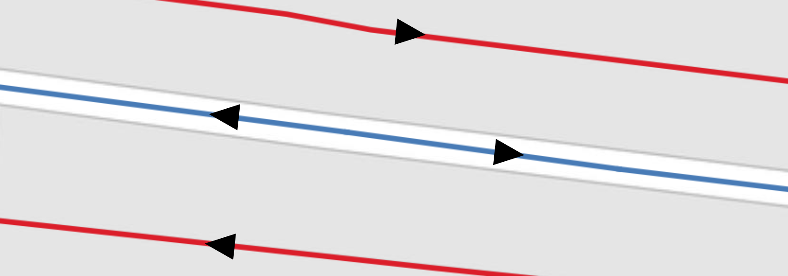
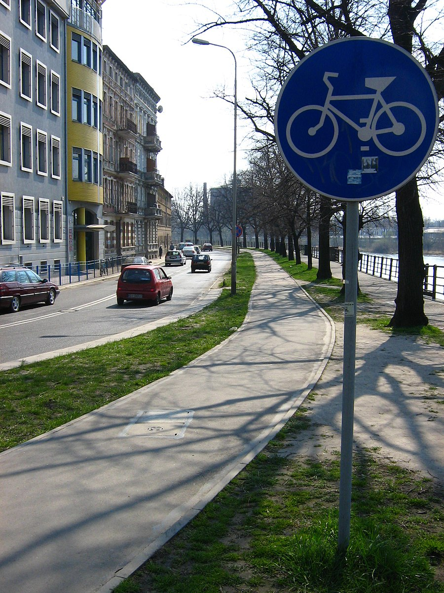
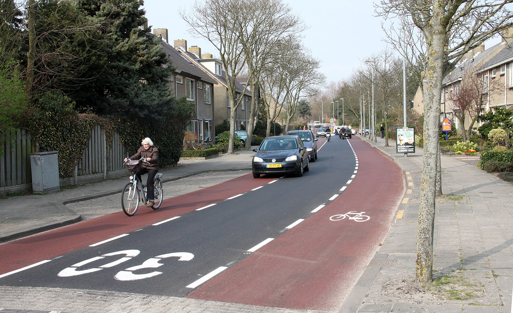

# Data set requirements for BikeDNA

## Study area input requirements

- The study area must be defined by a **polygon** in `gpkg` format. **Note**: If a different file name or file extension is used, the file paths in notebooks 1a and 2a must be updated. The file must be in a format readable by [GeoPandas](https://geopandas.org/en/stable/docs/user_guide/io.html) (e.g., GeoPackage, GeoJSON, Shapefile etc.).
- To generate the polygon, use for example [geojson.io](<https://geojson.io/>) to draw and download a polygon of the desired area, save as `study_area_polygon`, and update the file paths in notebooks 1a and 2a to match the chosen format.
- The polygon must be placed in the folder structure as follows: `/data/study_area_polygon/'my_study_area'/study_area_polygon.gpkg`

## OSM settings

### Custom filter

The queries in `config.yml` provides one way of getting the designated bicycle infrastructure from OSM data. What is considered bicycle infrastructure - and how it is tagged in OSM - is however highly contextual. If you want to use your own filter for retrieving bicycle infrastructure, set `use_custom_filter` to *True* and provide the custom filter under the `custom_filter` variable. For an example of how it should be formatted, see the provided filter `bicycle_infrastructure_queries`.

*Please note that  all ':' in OSM column names are replaced with '_' in the preprocessing of the data to enable using pandas.query without errors.*

### OSM infrastructure type

Similarly, the `config.yml` contains a dictionary with queries used to classify all OSM edges as either protected, unprotected, or mixed (if there is protected infrastructure in one side and unprotected on the other side). Update if needed, but note that it should correspond to the queries used to define the bicycle infrastructure - i.e., all edges must be classified as either protected, unprotected, or mixed.

### Missing tag analysis

In the intrinsic analysis, one element is to analyze how many edges have values for attributes commonly considered important for evaluating bike friendliness. If you want to change which tags are analyzed, modify the dictionary `missing_tags_analysis`. Please note that the relevant tags might depend on the geometry type (i.e. center line or true geometry, see below).

### Incompatible tags analysis

OSM has guidelines, but no restrictions on how tags can be combined. This sometimes results in contradictory information, for example when a path is both tagged as *'highway=cycleway'* and *'bicycle=dismount'*. The default configuration includes a dictionary with a few examples of tag combinations that we consider incompatible, but more entries can be added.

The dictionary is a nested dictionary, where the first key is a sub-dictionary with the name of the column - e.g., *'bicycle_infrastructure'*. The dictionary value for *'bicycle_infrastructure'* is the actual value for the column bicycle_infrastructure (e.g., *'yes'*), that is considered incompatible with a list of column-value combinations, available as a list of values for the sub-dictionary under *'yes'* as a key.

## Reference data input requirements

If the extrinsic analysis is to be performed:  

- The reference datase must be a GeoPackage called `reference_data.gpkg`.  If a different file name or file extension is used, the file path in notebook 2a must be updated. The file must be in a format readable by [GeoPandas](https://geopandas.org/en/stable/docs/user_guide/io.html) (e.g., GeoPackage, GeoJSON, Shapefile etc.).  
- The reference dataset must be placed in the folder structure as follows: `/data/reference/'my_study_area'/raw/reference_data.gpkg`

For the code and the analysis to run without errors, the data must:

- only contain **bicycle infrastructure** (i.e. not also the regular street network)
- have all geometries as **LineStrings** (not MultiLineStrings)
- have **all intersections** represented as LineString endpoints (if nodes are missing at intersections, this will distort topology- and connectivity metrics)
- be in a **CRS** recognized by GeoPandas
- contain a column describing the **type of bicycle infrastructure**, i.e. whether each feature is a physically **protected**/separated infrastructure or if it is **unprotected** (*feature* refers to a network edge - each row in the network edge GeoDataFrames thus represents one feature)
- contain a column describing whether each feature is **bidirectional** or not (see below for details)
- contain a column describing how features have been digitized (**'geometry type'**) (see below for details)
- contain a column with a unique **ID** for each feature

For an example of how a municipal dataset with bicycle infrastructure can be converted to the above format, see the notebooks [reference_data_preparation_01](scripts/examples/reference_data_preparation_01.ipynb) and [reference_data_preparation_02](scripts/examples/reference_data_preparation_02.ipynb) for workflows for preprocessing two different public Danish datasets on bicycle infrastructure.

### Reference Geometries

In the *config.yml*, the setting `reference_geometries` refers to how the bicycle infrastructure have been digitized. The analysis operates with two different scenarios: either the bicycle infrastructure has been mapped as an attribute to the center line of the road (this is often done when the bicycle infrastructure is running along or are part of a street with car traffic) *or* it has been digitized as its own geometry.
In the first scenario you will only have one line, even in situations with a cycle track on each side of the street, while two cycle tracks on each side will result in two lines in the second scenario.

If a dataset only includes one type of mapping bicycle infrastructure, you can simply set `reference_geometries` to either *'centerline'* or *'true_geometries'*.

If the data, like OSM, includes a variation of both, the data must contain a column named *'reference_geometries'* with values being either *'centerline'* or *'true_geometries'*, specifying the digitization method for each feature.

The illustration below shows a situation where the same bicycle infrastructure has been mapped in two different ways. The blue line is a center line mapping, while the red lines are from a dataset that digitizes all bicycle infrastructure as individual geometries.

### Cycling directions

Due to the different ways of mapping geometries described above, datasets of the same area will have vastly different lengths if you do not consider that the blue line on the illustration above is bidirectional, while the red lines are not. To enable more accurate comparisons of length differences, the data must either contain a column *'bidirectional'* with values either True or False, indicating whether each feature allows for bicycle in both directions or not.
If all features in the reference dataset have the same value, you can simply set `bidirectional` as either *True* or *False* in the `config.yml`.

### Bicycle infrastructure type

The 'bicycle infrastructure' type simply refers to whether infrastructure is protected (i.e. physically separated from car traffic) or unprotected (e.g. a bike path only marked with paint).

The setting requires a dictionary, `ref_bicycle_infrastructure_type` with two entries: `protected` and `unprotected`. For each entry a list of queries must be provided that returns respectively the protected or unprotected infrastructure.

For example, the query `"vejklasse == 'Cykelsti langs vej'"` returns all the protected bicycle infrastructure in the test data from GeoDanmark available in the repository.

*Protected cycle track. Attribution: [wiki.openstreetmap](https://wiki.openstreetmap.org/wiki/File:Sciezki_wroclaw_wyspianskiego_1.jpg)*

*Unprotected cycle lane. Attribution: [wiki.openstreetmap](https://wiki.openstreetmap.org/wiki/File:Fietsstrook_Herenweg_Oudorp.jpg)*

